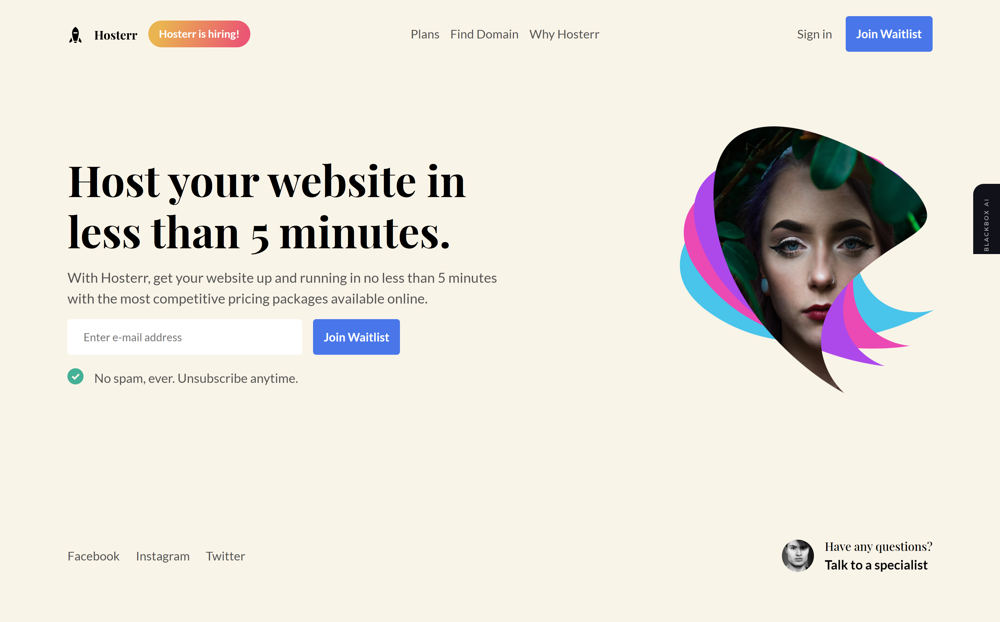

# Hosterr Challenge

- [Hosterr Challenge](#hosterr-challenge)
  - [Overview](#overview)
    - [Screenshot](#screenshot)
    - [Links](#links)
  - [Made using](#made-using)
  - [Challenges faced](#challenges-faced)
    - [Fonts Used](#fonts-used)

## Overview

### Screenshot

### Links

- Solution URL: [https://github.com/ShrutiShinde418/hosterr](https://github.com/ShrutiShinde418/hosterr)
- Live Site URL: [https://shrutishinde418.github.io/hosterr/](https://shrutishinde418.github.io/hosterr/)
## Made using

- Bootstrap 5.1
- Semantic HTML

## Challenges faced

- Position the image and its background

### Fonts Used

- <https://fonts.google.com/specimen/Lato>
- <https://fonts.google.com/specimen/Playfair+Display>

